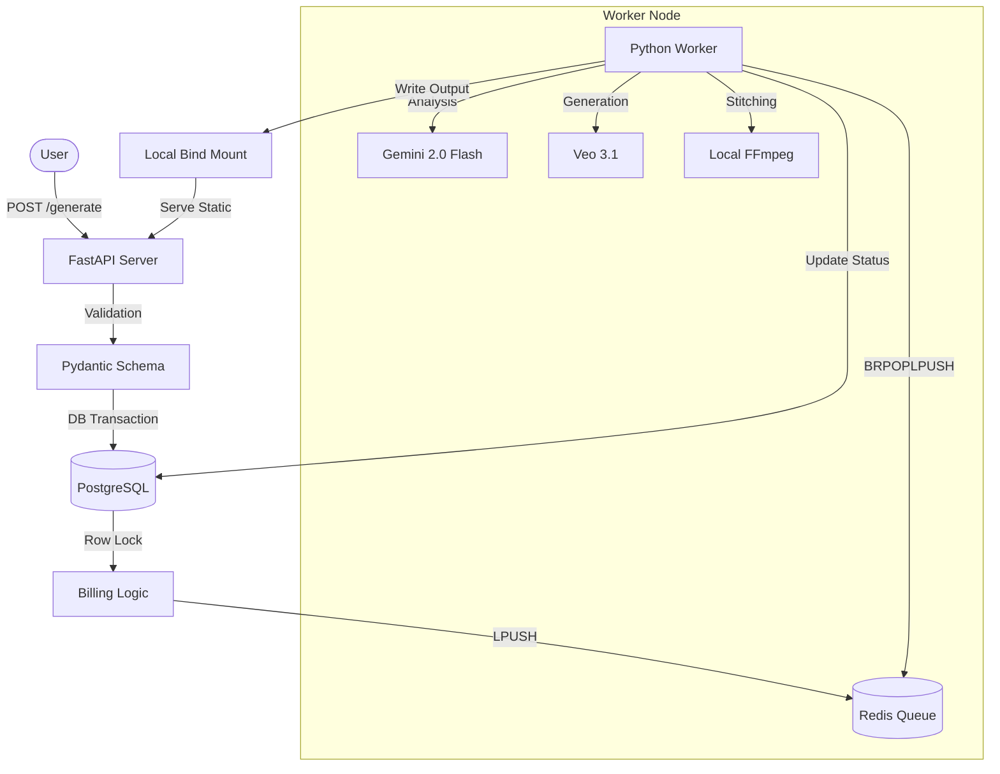

# Project Continuity: Technical Architecture & Whitepaper

Project Continuity is a distributed, fault-tolerant SaaS platform for AI-driven video bridging. This document outlines the architectural decisions, safety mechanisms, and orchestration strategies implemented to ensure reliability, financial integrity, and scalability.

## Executive Summary

Continuity orchestrates a complex workflow involving Google Vertex AI (Gemini 2.0 Flash for analysis, Veo 3.1 for generation) and local FFmpeg processing. The system is designed around a decoupled producer-consumer architecture backed by Redis, ensuring zero job loss and strict financial compliance.



## Core Systems

### 1. Persistence & Reliability (The `BRPOPLPUSH` Pattern)

To guarantee "at-least-once" delivery, the worker (`agent.py`) utilizes the Redis `BRPOPLPUSH` (Blocking RPOP, LPUSH) pattern.

*   **Atomic Move:** When a worker picks up a job, it is atomically moved from the `continuity_jobs` queue to a `continuity_processing` list. This ensures that if the worker crashes mid-process, the job is not lost but remains in the processing list.
*   **Crash Recovery:** On startup, the `_requeue_inflight` function inspects the `continuity_processing` list. Any items found there are treated as "inflight" from a previous crashed session and are immediately requeued to `continuity_jobs` for processing.

```python
# agent.py (Concept)
def _requeue_inflight(redis_client):
    while True:
        # Move stranded jobs back to the main queue
        item = redis_client.rpoplpush(PROCESSING_QUEUE, JOB_QUEUE)
        if not item: break
```

### 2. Financial Safety & Idempotency

The billing system (`billing.py`) enforces strict ACID compliance to prevent double-spending or race conditions, critical for a credit-based SaaS.

*   **Row-Level Locking:** All balance modifications use `SELECT ... FOR UPDATE`. This locks the specific user row in the database transaction, forcing concurrent requests to wait until the first transaction commits or rolls back.
    *   *Implementation:* `db.query(User).filter(...).with_for_update().first()`
*   **Idempotency:** The `Transaction` model includes a unique constraint on `stripe_event_id` to prevent duplicate webhook processing. Additionally, a composite unique index on `(reference_id, type)` ensures a job cannot be reserved or refunded twice.

### 3. Validation Boundaries

To protect the GPU-intensive worker from invalid inputs, validation is enforced strictly at the API boundary (`server.py`).

*   **Resolution Constraints:** The `resolution` field is validated against a strict allowlist (`720p`, `1080p`, `4k`).
*   **Filesystem Integrity:** The `_validate_video_paths` function verifies the physical existence of input files before a job is ever queued, preventing "file not found" errors deep in the worker pipeline.

### 4. Resource Management (The `shutil.rmtree` Pattern)

The `continuity-stitch` library implements a robust cleanup strategy to prevent disk exhaustion from temporary intermediate frames.

*   **Managed Context:** The `VideoStitcher` class uses a `try...finally` block to ensure cleanup.
*   **Safe Deletion:** A `_managed_temp_dir` flag tracks if the directory was created by the stitcher. If true, `shutil.rmtree(temp_dir)` is called in the `finally` block, ensuring all temp files are purged even if the stitching process raises an exception.

## Orchestration & DevOps

The infrastructure is containerized and managed via Docker Compose, with specific `Makefile` targets for maintenance.

### Healthcheck Dependencies
The `docker-compose.yml` defines a strict dependency chain. The `server` and `worker` services depend on `redis` with `condition: service_healthy`.
*   *Redis Healthcheck:* `redis-cli ping` (Interval: 5s, Retries: 5). This prevents the application from starting before the persistence layer is ready.

### Makefile Targets
*   `make backup`: Performs a hot backup.
    *   Dumps PostgreSQL schema/data: `pg_dump -Fc ... > postgres-TIMESTAMP.dump`
    *   Snapshots Redis state: `docker cp ...:/data/appendonly.aof`
*   `make update`: Zero-downtime-ish update. Pulls git changes, updates Python deps, and restarts containers.
*   `make prune`: Deep cleanup. Prunes unused Docker images and finds/deletes `*.tmp`, `*.partial`, and `*.crash` files in `outputs/`.

## The "Golden Thread"

The lifecycle of a request flows as follows:

1.  **Ingest:** User POSTs to `/generate`. `server.py` validates inputs (resolution, paths) and creates a `Job` record (status: `queued`).
2.  **Queue:** The job payload is JSON-serialized and pushed to Redis `continuity_jobs`.
3.  **Process:** The `worker` (via `brpoplpush`) atomically moves the job to `continuity_processing`.
4.  **Generate:**
    *   User credits are reserved (`billing.reserve_credits`).
    *   Gemini 2.0 analyzes video context.
    *   Veo 3.1 generates the bridge.
5.  **Stitch:** `continuity-stitch` merges the clips locally using FFmpeg.
6.  **Finalize:** The output is written to the bind-mounted `outputs/` directory. The `Job` record is updated (status: `completed`), and the transaction is settled.
7.  **Serve:** The file is available via Nginx/FastAPI static mount at `/outputs/{job_id}_merged.mp4`.
